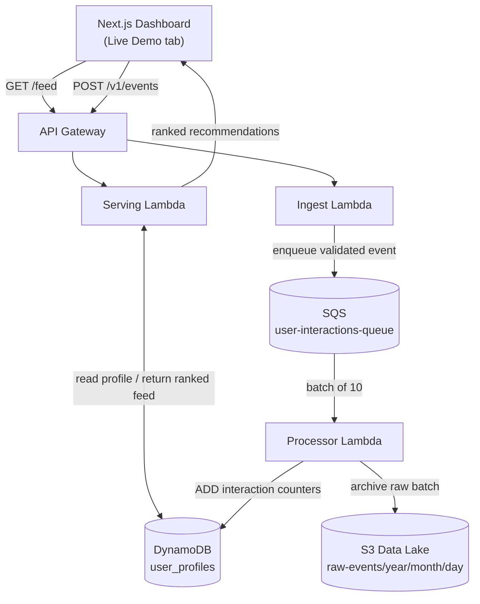
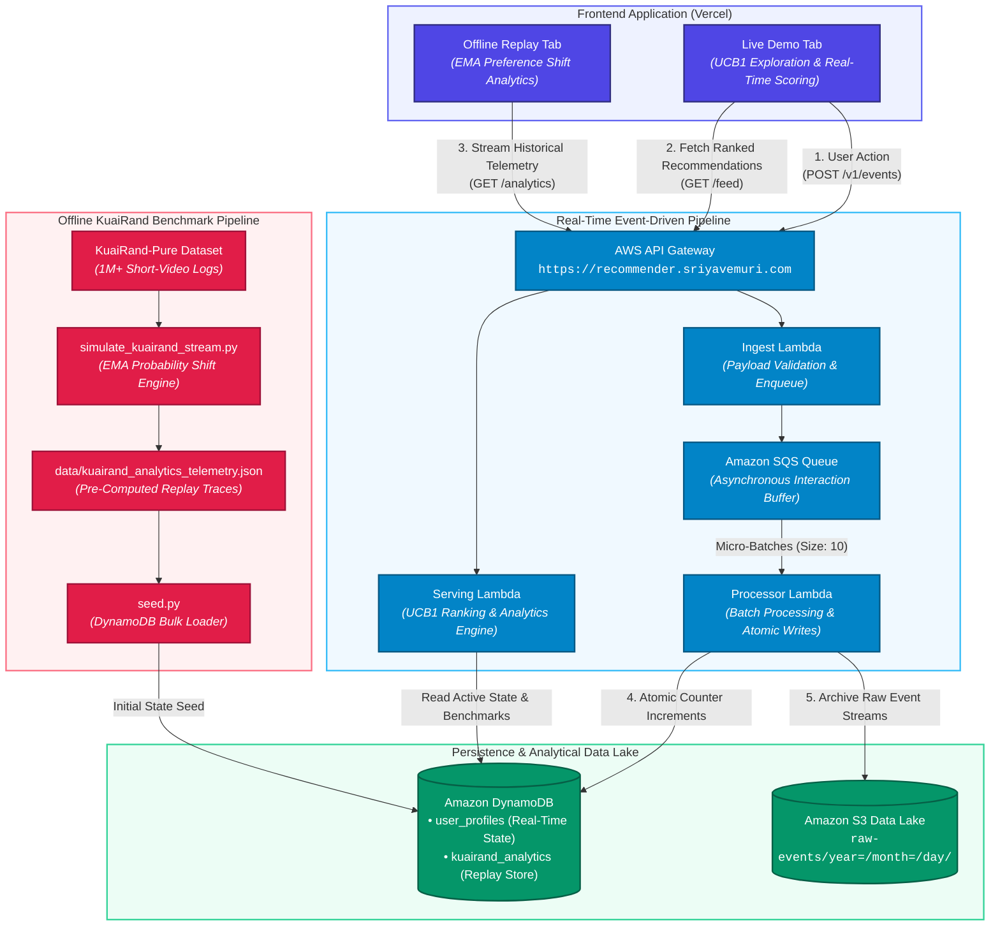

# Real-Time Personalization Engine

A serverless, event-driven video recommendation system with a live UCB1 multi-armed bandit engine and a companion offline replay of a real-world benchmark dataset.

[Click here to access the live website!](https://recommender.sriyavemuri.com)

---

## What the Project Does

- **Live UCB1 bandit engine**: Ranks 30 candidate videos across 10 content categories in real time using a custom Upper Confidence Bound (UCB1) + category-affinity scoring formula, balancing exploiting what a user already likes against exploring untried categories.
- **Fully event-driven AWS ingestion pipeline**: Every like, hate, share, comment, and long-view fires `API Gateway -> SQS -> Lambda -> DynamoDB`, decoupling the user-facing response from asynchronous feature-store updates.
- **Self-correcting dislike handling**: A dedicated "hate" penalty (`-10.0`, steeper with repeat hates) demotes an entire category and immediately promotes untried ones, so the feed visibly adapts within a single interaction.
- **Offline KuaiRand benchmark replay**: A second tab replays 25 real historical interaction events from the KuaiRand short-video dataset through a separate, independent EMA (exponential moving average) category-adaptation model. It is deliberately decoupled from the Live Demo's UCB1 math, since the two answer different questions: live exploration vs. offline historical replay.
- **Zero client-side score fabrication for analytics**: Category-probability shift, CTR/long-view convergence, and pre/post score distribution are all computed server-side and served straight out of DynamoDB by a single Lambda. The dashboard only renders what the backend actually computed.
- **Infrastructure as Code, end to end**: Every Lambda, IAM role/policy, DynamoDB table, SQS queue, S3 bucket, and API Gateway route is declared in Terraform and reproducible from a single `terraform apply`.

---

## How It Works

1. **Load the feed**: The Next.js dashboard calls `GET /feed?user_id=...`. The serving Lambda reads (or cold-starts) the user's profile from the `user_profiles` DynamoDB table and returns the 30 candidates ranked by UCB1 + category-affinity score.
2. **User interacts**: A like/hate/share/comment/long-view triggers `handleInteraction()`, which optimistically re-ranks the feed client-side (the *exact same* scoring formula as the backend, kept in parity across TypeScript and Python) and fires `POST /v1/events`.
3. **Ingest**: The ingest Lambda validates the payload (`user_id`, `item_id`, `event_type`), stamps `ingested_at`, and pushes it onto the `user-interactions-queue` SQS queue. The client gets a fast `202 Accepted` without waiting on downstream processing.
4. **Process**: SQS triggers the processor Lambda in batches of 10. It atomically `ADD`s the interaction counters onto the user's `user_profiles` item (`impressions_count`, `likes_count`, `hates_count`, etc.) and archives the raw event batch to an S3 data lake, partitioned by `year/month/day`.
5. **Loop closes**: The next `/feed` call re-reads the now-updated DynamoDB profile and returns freshly ranked recommendations, reflecting everything the user has done so far.
6. **Offline replay (separate path)**: The "Offline Model Replay" tab calls `GET /analytics?user_id=...`, which queries the `kuairand_analytics` table for a single pre-computed aggregated summary row per user (written once by `scripts/seed.py`, sourced from `scripts/simulate_kuairand_stream.py`'s offline EMA replay over the real KuaiRand-Pure dataset) and renders it with Recharts. No live scoring is involved.

---

## Architecture

### Live Demo (real-time UCB1 pipeline)



### Offline Model Replay (KuaiRand benchmark)



---

## Tech Stack

**ML / Scoring**
- Custom UCB1 (Upper Confidence Bound) multi-armed bandit, implemented in parity across Python (`lambda/serving.py`) and TypeScript (`dashboard/src/app/page.tsx`)
- Category-affinity heuristic scoring (positive-event boosts, hate-event penalties/promotions)
- Offline EMA (exponential moving average) category-adaptation model replaying real KuaiRand-Pure interaction logs (`scripts/simulate_kuairand_stream.py`)
- pandas / numpy for dataset processing and simulation

**Backend / AWS**
- AWS Lambda (Python 3.11): `ingest`, `processor`, `serving`
- Amazon API Gateway (HTTP API v2, CORS-enabled)
- Amazon SQS (`user-interactions-queue`) for decoupling ingestion from processing
- Amazon DynamoDB (PAY_PER_REQUEST): `user_profiles`, `kuairand_analytics`
- Amazon S3 for the raw event data lake, partitioned by date
- IAM roles/policies scoped per Lambda (least privilege)

**Frontend**
- Next.js 16 (App Router), React 19, TypeScript
- Tailwind CSS v4
- Recharts (Area/Bar charts for the analytics dashboard)
- Heroicons (`@heroicons/react`)

**DevOps**
- Terraform (`hashicorp/aws` ~> 5.0) for full infra as code, including `archive_file` auto-zipping of Lambda source on every `apply`
- Vercel for frontend hosting and deployment
- boto3-based Python utility scripts for seeding and regression testing (`scripts/`)

---

## What I Learned

1. **Decoupling has tradeoffs.** `API Gateway -> SQS -> Lambda` returns instantly, but client and backend state can briefly disagree, so the frontend reconciles optimistic local state against DynamoDB with `Math.max()` merges instead of trusting either side blindly.
2. **Keeping one formula in sync across two runtimes takes discipline.** An unused, half-duplicated Python copy of the UCB1 math had a silently reversed substring check that would have produced wrong results if it were ever wired in.
3. **A DynamoDB composite key can quietly hold two incompatible shapes.** Two scripts writing different assumptions into the same `(user_id, video_id)` table caused a bug that was only visible by tracing the actual `Query` response.
4. **A `useState` initial value fires once per mount, not once per logical reset.** A tab that never unmounts needs an explicit reset branch tied to the real trigger event, or stale state leaks forward.
5. **Bilingual data does not map itself.** The 8 canonical categories parse cleanly from a `"<Chinese> (<English>)"` convention, but the long tail of raw event tags needed an explicit, hand-maintained dictionary with a graceful fallback.

---

## Getting Started Locally

**1. Frontend**
```bash
cd dashboard
npm install
```
Create `dashboard/.env.local` pointing at your deployed API Gateway:
```bash
NEXT_PUBLIC_API_URL=https://<your-api-id>.execute-api.us-east-2.amazonaws.com
NEXT_PUBLIC_FEED_ENDPOINT=https://<your-api-id>.execute-api.us-east-2.amazonaws.com/feed
NEXT_PUBLIC_EVENTS_ENDPOINT=https://<your-api-id>.execute-api.us-east-2.amazonaws.com/v1/events
```
```bash
npm run dev
```

**2. Infrastructure (Terraform)**
```bash
cd terraform
terraform init
terraform plan
terraform apply
```
Requires AWS credentials configured for the `us-east-2` region. This provisions the API Gateway, all three Lambdas, SQS queue, both DynamoDB tables, and the S3 data lake, and auto-zips the Lambda source on every apply via `archive_file`.

**3. Seed the offline analytics dataset**
```bash
pip install boto3 pandas numpy
python scripts/simulate_kuairand_stream.py   # regenerates data/kuairand_analytics_telemetry.json from the raw KuaiRand-Pure CSVs
python scripts/seed.py                       # clears and reseeds the kuairand_analytics DynamoDB table from that JSON
```

**4. Run the regression tests**
```bash
python scripts/test_live_demo_ranking.py
```
Verifies the UCB1 + category-affinity scoring logic in `lambda/serving.py` (cold start, category boosts, hate-penalty demotion, `/feed` response shape).

**5. Open the app**

Visit your local dev server at `http://localhost:3000`, or the deployed site above.
